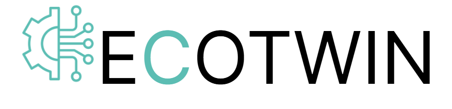

  

# ECOTWIN Reference Architecture

## Introduction

### What is ECOTWIN?

The **E**dge-**C**loud **O**perative Digital **TWIN** project attempts to develop of a powerful and sustainable multi-provider edge-cloud continuum.
This will enable next-generation AI and industrial process simulation services.
The aim of the ECOTWIN reference architecture is to prescribe how all the technologies fit together to provide the edge-cloud continuum.

**ECOTWIN** is a cloud-edge extension of **StrömungsRaum (SR)** that turns SR’s simulation/optimization/AI capabilities into a **distributed “cloud ↔ edge” digital-twin fabric**. It lets you run **inference and monitoring close to machines at the edge**, while **training, DoE, and heavy simulation** continue in SR’s cloud/HPC core—connected by a governed data/metadata plane.

**Key ideas**

- **Twin continuum:** Edge twins (fast inference, anomaly/drift detection) pair with cloud twins (hi-fi sims, retraining, optimization).
- **Policy-first data flow:** Classified, encrypted **ingress/egress** between edge sites and SR’s enterprise data fabric.
- **Lifecycle sync:** Model registry, versioning, and **promotion** propagate from cloud to edge with staged rollouts and rollback.
- **Resilience & locality:** Works offline/intermittent; buffers events and reconciles when connectivity returns.
- **Agentic operations (optional):** Edge agents can trigger **retraining** or **parameter updates** upstream based on drift/quality KPIs.

**What it adds to SR**

- Edge runtimes & connectors (OPC UA/MQTT)
- Deployment policies for **geo/residency** and **SLOs** per site
- Managed **over-the-air** updates for models and monitoring rules
- Unified observability & FinOps across cloud and edge scopes

### What is StrömungsRaum?

**StrömungsRaum (SR)** is an **industry cloud platform** for **high‑fidelity simulation**, **optimization**, and **AI models**—built for **HPC at scale** (cloud / on‑prem / hybrid).

Learn more about the StrömungsRaum platform at [ianus-simulation.de/stroemungsraum](https://ianus-simulation.de/stroemungsraum).

## Value Proposition (at a glance)

- **Time‑to‑Value:** Turn input data into trustworthy results in hours instead of weeks.
- **Scale:** Thousands of parallel runs (DoE/optimization/training) across orchestrated compute on supercomputers.
- **Quality & Reproducibility:** Versioned process chains, data/model governance, SLO‑backed.
- **Secure Data Paths:** Policy‑driven **egress** into the enterprise data fabric, OIDC federation, auditability.

## Concepts

Many components are networked together to provide an edge-cloud continuum.
The entities that make the network can be categorized into:

- Software resources
- Hardware Resources
- Network Resources
- People
- Business Resources

They have been outlined in the [concepts](./docs/concepts.md) document.

## Digital Twin Controller **twinctl**

In order to manage the edge-cloud continuum a controller is proposed.
This controller will tie into all the software stacks that are used.
Each individual twin will be configured using a set of YAML files.
The controller will be use the twin information to make sure that dependent tools have consistent information.

Twin controller is further documented in [twinctl](./docs/twinctl.md).

## Funding

For programme details and usage guidance, see [Funded By](./docs/funding.md).

## Partners

- [IANUS Simulation GmbH](https://ianus-simulation.de/)
- [TU Dortmund University — Institute for Applied Mathematics and Numerics](https://wwwold.mathematik.tu-dortmund.de/lsiii/cms/en/lehrstuhl3.html)
  - [FeatFlower Repo on github.com](https://github.com/rmuenste/FeatFloWer/tree/master)
  - [FEAT3 Repo on github.com](https://github.com/tudo-math-ls3/feat3)
  - [MeshHexer on github.com](https://github.com/tudo-math-ls3/MeshHexer)
- [TU Darmstadt - Computational Multiphase Flow group](https://www.mathematik.tu-darmstadt.de/cmf/cmf_home/index.de.jsp)

## License

This project is released under the terms described in the [license](./license.md).
