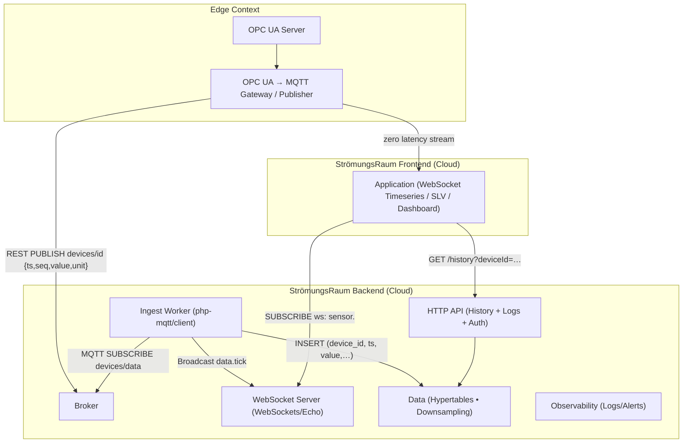
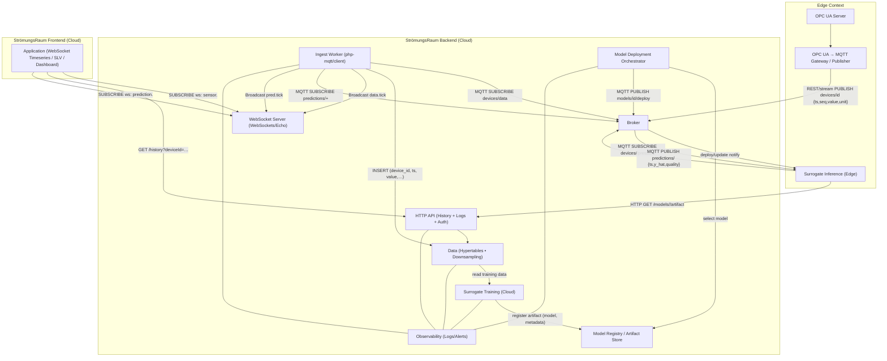

# Software Resources

## Workload Manager / Batch Manager

Schedules and dispatches HPC/Cloud jobs with queuing, priorities, resource quotas, and policy enforcement.

## Containerized Application (Apptainer)

Portable, reproducible runtime image for Sim/AI workloads optimized for HPC environments.

## Application

User-facing UI/API component that orchestrates processes and accesses models through explicit model-gates.

## Optimization Agent

Rule/ML-driven service that tunes control variables to optimize targets (e.g., kWh/m³, throughput) under constraints.

## AI Agent

Goal-driven orchestrator that plans/runs sims, updates surrogates, and proposes/executes control actions autonomously.

## Service

- **Heavy-weight** – Resource-intensive, usually batch/cluster bound (HiFi simulation, large training).
- **Light-weight** – Low-latency edge/API service (surrogate inference, stream analytics).
- **asynch** – Non-blocking execution using queues/callbacks/events.
- **synch** – Request/response with bounded latency on the critical path.

## Sim-as-a-Service (Sim-aaS)

On-demand HiFi simulation on HPC/Cloud with automated meshing, scheduling, and artifact capture.

## Opt-as-a-Service (Opt-aaS)

Autonomous optimization loop (e.g., Bayesian/EAs) orchestrating simulations and surrogates against defined KPIs.

## Model

- **Simulation Model (High-Fidelity)** – Physics-accurate, compute-heavy ground-truth model (e.g., CFD/FEM).
- **Surrogate Model** – Fast approximation of HiFi behavior (ML/ROM) suitable for real-time use.
- **Reduced Order Model** – Physics-preserving model reduction (e.g., MOR/POD) with low dimensional state.

## Model Gate

Contracted access point from apps/processes to models (I/O schema, latency/SLA, validation status).

## Data Bridge

Streaming/batch interoperability layer for model↔model and model↔edge data (schema mapping, QoS, lineage).

## Sensor Bridge

Edge adapter for timestamped P/Q/T/vib/strain signals incl. filtering, sync, unit and non-dimensional transforms.

## Thread / Process (technical)

OS-level execution units: a **process** has its own address space; **threads** share memory within a process—mapped to containers/Pods/VMs with explicit CPU/memory/NUMA/SIMD/GPU binding.

## Job

Concrete execution instance of a workload with inputs, resources, lifecycle, and artifacts.

## Batch

Grouped jobs executed under a shared policy/time window and consistent data snapshot.

## Artifact Registry

Versioned store for meshes, configs, checkpoints, and surrogate snapshots with provenance/SBOM.

## HPC Queue / QoS Class

Workload class with preemption/priority, reservation, and accelerator constraints under scheduler control.

## Layer

- **Process Layer** – Domain-specific step chain with **process-gates** (temporal/spatial causality, handover/rollback criteria).
- **Application Layer** – Verticals and apps initiating and coordinating processes.
- **Model Layer** – HiFi/Surrogate/ROM assets exposed via model-gates.
- **Domain Layer** – Multiphysics domains (e.g., flow, heat, deformation) and their couplings.
- **Data Layer** – Persistence, data-bridge, feature pipelines, metadata/catalog.
- **Execution Layer** – Runtime targets (edge/cluster/cloud) and control loops.

## Process (industrial)

Business/engineering workflow step (domain-specific) with defined inputs/outputs, QoS, KPIs and **process-gates** across the value chain.

## Virtual Representation (VR)

Abstract data-driven view of an asset/system without full simulation synchronization.

## Virtual Prototype (VP)

Composable, simulatable bundle of domains and models representing a system design.

## Digital Twin (DT)

Bi-directionally synchronized VP/VR with live data, state estimation, and actuation path.

### Edge-ready Digital Twin
A cloud-native digital twin that is connected to the cloud's edge, the following additional architectures apply.

#### Data Live cycle
**Edge Context.** The **OPC UA Server** exposes machine signals; the **Gateway / Publisher** converts them into compact JSON and **publishes** them to the **Broker** using the configured path (e.g., `REST PUBLISH devices/id {ts, seq, value, unit}`). For operator UIs on-site, the gateway can also push a **zero-latency stream** directly to the **Frontend App** for local HMI views.

**StrömungsRaum Backend (Cloud).** The **Broker** decouples producers and consumers and fans out messages reliably. The **Ingest Worker (php-mqtt/client)** **subscribes** to the data topic set (e.g., `MQTT SUBSCRIBE devices/data`), writes rows to the **Data Store (Hypertables • Downsampling)**, and emits live events (`data.tick`) via the **WebSocket Server (WebSockets/Echo)**. The **HTTP API (History + Logs + Auth)** serves historical reads and access-controlled logs from the same data store. **Observability (Logs/Alerts)** monitors ingest, API, and database health end-to-end.

**StrömungsRaum Frontend (Cloud).** The **Application (WebSocket Timeseries / SLV / Dashboard)** **subscribes** to the WebSocket channel (e.g., `ws: sensor.<deviceId>`) for real-time charts and **GETs** history from the API. The same app can also be **deployed/shown on the Edge** when local UX is required.

#### Edge-deployed AI model lifecycle
 assembles the training set. A basic **DoE Planner** (design-of-experiments) triggers **HiFi Simulations (CFD/FEM)** where needed; simulation results loop back to the data store and into **Data Prep**. The **Surrogate Trainer (fit/validate)** produces a model artifact registered in the **Model Registry / Artifact Store**.

**Deployment (Cloud→Edge).** The **Model Deployment Orchestrator** selects a version from the registry and announces roll-out (e.g., `MQTT PUBLISH models/<id>/deploy`). At the edge, the **Surrogate Inference (Edge)** pulls the artifact via the **HTTP API** (`GET /models/<id>/artifact`) and activates it.

**Inference (Edge).** The edge surrogate **subscribes** to the live device topic (e.g., `MQTT SUBSCRIBE devices/data`), performs inference, and **publishes** predictions (e.g., `MQTT PUBLISH predictions/<id> {ts, y_hat, quality}`). The **Ingest Worker** also **subscribes** to predictions, persists them, and broadcasts `pred.tick` over WebSockets so the **Frontend App** can **subscribe** to `ws: prediction.<deviceId>` alongside raw sensor channels. All stages feed **Observability** for metrics and alerts.

#### Roles of the entities (at a glance)
- **OPC UA Server** — machine interface exposing signals.
- **Gateway / Publisher** — transforms OPC UA nodes to JSON; publishes to broker; can mirror a zero-latency stream to the frontend.
- **Broker** — reliable fan-out and decoupling hub for edge→cloud data.
- **Ingest Worker** — subscribes, persists, and broadcasts (`data.tick` / `pred.tick`).
- **Data Store (Hypertables • Downsampling)** — time-series storage and history source.
- **WebSocket Server** — real-time delivery to dashboards and SLV.
- **HTTP API (History + Logs + Auth)** — secure, audited access to historical data and logs.
- **Frontend Application** — WebSocket timeseries charts; history retrieval; deployable at cloud or edge.
- **Training (subgraph)** — Data Prep, DoE Planner, HiFi Simulations, Surrogate Trainer, Model Registry.
- **Deployment Orchestrator** - selects/announces model versions; coordinates edge updates.
- **Surrogate Inference (Edge)** — pulls artifacts, subscribes to sensor topics, publishes predictions.