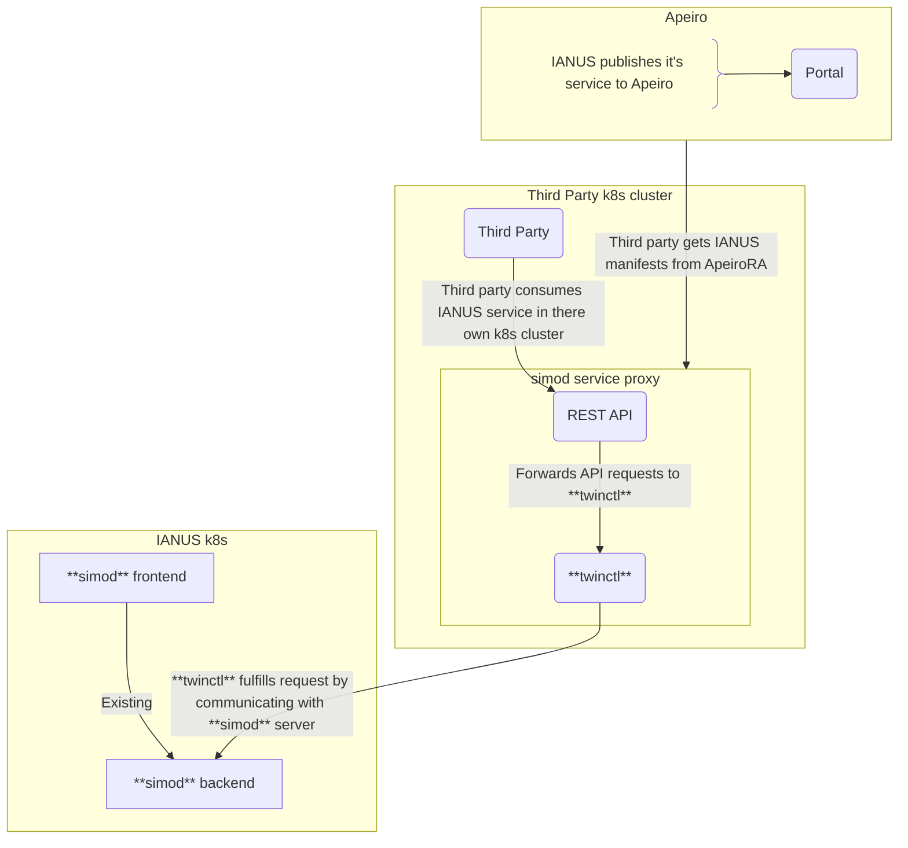

# IANUS Integration to ApeiroRA Diagram

```mermaid
flowchart TD
    subgraph Apeiro
        direction LR
        IP@{ shape: brace-r, label: "IANUS publishes it's service to Apeiro" }
        ARA1(Portal)
        IP-->ARA1
    end

    subgraph ss [IANUS k8s]
        id23[**simod** backend]
        id24[**simod** frontend]
        id24-->|Existing|id23
    end

    subgraph tpc [Third Party k8s cluster]
        subgraph sp [simod service proxy]
            id21(REST API)
            id22(**twinctl**)
            id21-->|Forwards API requests to **twinctl**|id22
        end
        id32(Third Party)
        id32-->|Third party consumes IANUS service in there own k8s cluster|id21
    end


%%    Apeiro----|simod publishes manifests to ApeiroRA|simod
    Apeiro--->|Third party gets IANUS manifests from ApeiroRA|sp
%%    id22-->|Fulfills request by contacting IANUS simod|id23
    id22-->|**twinctl** fulfills request by communicating with **simod** server|id23

```
